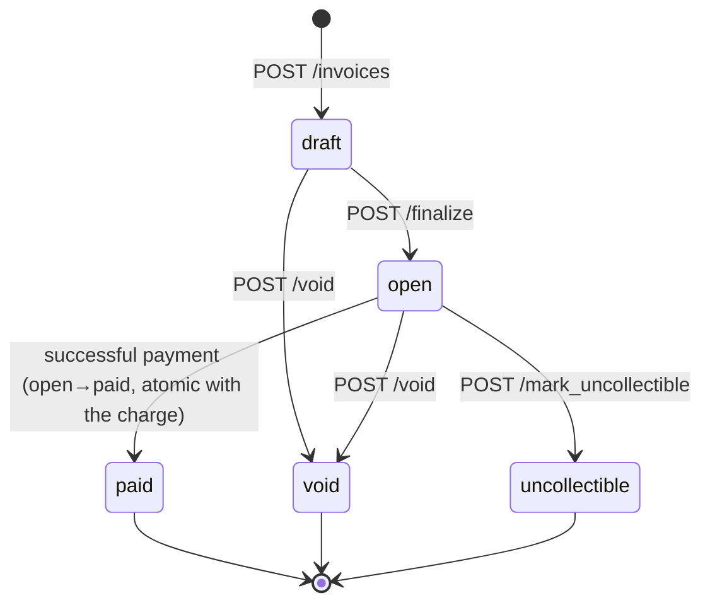

# DESIGN — Invoice & Payment Service

A small billing backend: a business creates invoices for customers, customers pay them
through a mock PSP, and the business is notified of state changes via signed webhooks.
Stack: **Rust / Axum / sqlx / Tokio / PostgreSQL**. Money is integer cents, USD only.

The interesting work is in the **state machine, money correctness, and failure modes** — so
that is what this document spends its words on.

---

## 1. Data Model

```
businesses ──< api_keys
     │
     ├──< customers ──< invoices ──< invoice_line_items
     │                     │
     │                     └──< payment_attempts   (1 active at a time)
     ├──< idempotency_keys
     └──< webhook_endpoints
          webhook_events ──< webhook_deliveries
```

| Table | Shape / notable columns | Key indexes |
|---|---|---|
| `businesses` | tenant root (`id`, `name`) | PK |
| `api_keys` | `prefix`, `key_hash bytea` (SHA-256), `last_four`, `revoked_at`, `expires_at` | **unique(`prefix`)** (lookup), `(business_id)` |
| `customers` | `email citext`, `name` | **partial unique(`business_id`,`email`)**, `(business_id, created_at DESC, id DESC)` |
| `invoices` | `state` enum, `total_cents bigint` (server-computed), `version` (optimistic), `*_at` timestamps | `(business_id, state, created_at DESC, id DESC)` — the list-by-state query |
| `invoice_line_items` | `quantity`, `unit_amount_cents`, `amount_cents` **GENERATED STORED** | `(invoice_id, position)` |
| `payment_attempts` | `idempotency_key`, `amount_cents` (snapshot), `card_token`, `status`, `psp_ref`, `failure_code`, `next_poll_at` | **partial unique(`invoice_id`) WHERE status IN ('pending','succeeded')** — the concurrency guard; partial `(next_poll_at) WHERE pending` |
| `idempotency_keys` | `request_fingerprint bytea`, `status`, cached `response_status/body` | **unique(`business_id`,`idempotency_key`)** |
| `webhook_endpoints` | `url`, `secret bytea`, `event_types[]`, `status` | `(business_id)` |
| `webhook_events` | immutable outbox; `payload jsonb`, `sequence bigserial` | `(business_id, created_at DESC, id DESC)` |
| `webhook_deliveries` | per-endpoint work item; `status`, `attempts`, `next_attempt_at`, `locked_until` | **unique(`event_id`,`endpoint_id`)**, partial `(next_attempt_at)` |

**PK strategy: UUIDv7, app-generated.** Time-ordered (good B-tree locality, unlike v4),
non-guessable (no IDOR/enumeration on the public ids that appear in URLs, webhooks, and PSP
correlation, unlike `bigserial`), and mintable before insert (needed to correlate a payment
attempt with the PSP before its row commits). Cost: 16 vs 8 bytes — worth it here. Internal
append-only tables (`webhook_events.sequence`) use `bigserial` where monotonic ordering matters.

**Why this shape over alternatives.** Money lives only as `bigint` cents with `CHECK (>= 0)`;
line totals are a `GENERATED ALWAYS AS (quantity * unit_amount_cents) STORED` column so the
*database* does the integer multiply, and the invoice total is a server-side `SUM` — there is no
column or code path where a float or a client-supplied total can enter. `business_id` is
denormalized onto every table so tenant scoping is a single-table predicate, never a join.

**At 100× scale.** Cache `api_keys` lookups (prefix → row) and move `last_used_at` off the request
path; range/hash-partition `invoices` and `payment_attempts` (by `created_at` or `business_id`)
and add BRIN indexes on time columns; partition-drop expired `idempotency_keys`; the webhook
tables become a candidate to move to a dedicated queue, but the outbox shape stays.

---

## 2. Invoice State Machine



| Transition | Trigger | Reversible? |
|---|---|---|
| draft → open | `POST /finalize` (line items freeze) | no |
| draft → void | `POST /void` (discard a draft) | no |
| open → paid | a payment attempt succeeds | no |
| open → void | `POST /void` (cancel) | no |
| open → uncollectible | `POST /mark_uncollectible` (write off) | no |

**Terminal:** `paid`, `void`, `uncollectible`. No transition out of these. **Payment is only
permitted from `open`.** There is deliberately **no transient `charging` state** — an in-flight
charge is represented by a `pending` row in `payment_attempts`, which pins the invoice via the
partial unique index (see §3). This keeps the invoice machine exactly as specified.

**Invalid transitions** are rejected at the API with `409 invalid_state_transition` and a precise
`{from, to}`. Admin transitions are loaded, validated against `can_transition_to`, then applied
with a **status-conditional `UPDATE ... WHERE state = $from` + version bump**, so a concurrent
transition can't double-apply (the loser gets 0 rows affected → 409). `open → paid` does *not* go
through this path; it is performed atomically inside the payment finalize transaction.

---

## 3. Payment Correctness & Failure Modes (the hard section)

**Two independent properties, two separate guards.** Conflating them is the classic bug:

- **Idempotency** (the *same* client request retried): `idempotency_keys`, unique
  `(business_id, idempotency_key)`, storing a request fingerprint + cached response.
- **Single-active-charge** (*distinct* requests/keys racing one invoice): the partial unique index
  `uq_active_attempt_per_invoice ON payment_attempts(invoice_id) WHERE status IN ('pending','succeeded')`.
  At most one attempt per invoice may be active.

**Mechanism: partial unique index + status-conditional claim, with NO database transaction held
across the PSP HTTP call.** The flow is two short transactions around an unlocked PSP call:

1. **Txn 1 (claim):** `INSERT idempotency_keys ... ON CONFLICT DO NOTHING` (fresh vs replay); verify
   invoice is `open`; `INSERT payment_attempts(status='pending')` — the index makes a racing insert
   fail with `23505`. Snapshot `amount_cents` from the invoice. Commit.
2. **PSP call** (`reqwest`, timeout 5s < the PSP's 30s), forwarding our idempotency key downstream.
3. **Txn 2 (finalize):** apply the outcome (below). Commit.

**Why this over the alternatives:**
- **`SELECT … FOR UPDATE` / advisory lock** — only protect the in-process critical section; the
  moment you (correctly) release before the PSP call, you still need the index to catch a racer, so
  the lock is redundant. Holding it *across* the 30s `tok_timeout` would pin a pooled connection and
  head-of-line-block everyone. Rejected.
- **`SERIALIZABLE`** — converts the race into `40001` aborts you must retry-loop, and does nothing
  across the PSP IO gap. The partial index gives a precise `23505` at exactly the right grain.
- **Optimistic `version` on the invoice / plain CAS** — both let two requests read `open`, both call
  the PSP, then one UPDATE wins — **but both already charged**. The guard must exist on the *attempt
  row created before the PSP call*, which is what the index gives. (We still keep `version` for the
  admin transitions.)

**Outcome → state mapping:**

| PSP result | attempt | invoice | HTTP |
|---|---|---|---|
| success | `succeeded` (+psp_ref) | → `paid` (atomic) | 200 |
| declined / insufficient_funds | `failed` (+code) | stays `open` (retryable, new key) | 402 |
| timeout / network error (unknown) | stays `pending` | stays `open` | 202 |

### The required cases

**(a) Two clients `POST /pay` the same invoice at the same instant.** Both run Txn 1; both try to
insert a `pending` attempt. The partial unique index admits exactly one; the other gets `23505` →
**409 `payment_in_progress`**. Only the winner calls the PSP. **At most one charge.** *(Verified by
the concurrency test: 12 concurrent → 1×200, 11×409, PSP called once, invoice `paid`.)*

**(b) PSP times out (`tok_timeout`, 30s; our client deadline 5s).** The client deadline fires first
= **unknown outcome**. We do not mark paid or failed; the attempt stays `pending`, and we return
**202** with a `poll_url`. The pending attempt pins the invoice (no new attempt can start). The
caller learns the result by polling `GET /v1/invoices/{id}/payments/{attempt}`; the **reconciler**
re-queries the PSP with the original idempotency key and terminalizes it. *(Verified: endpoint
returns in <3s in tests, invoice stays `open`, attempt `pending`.)*

**(c) PSP succeeds but we crash before persisting.** The `pending` attempt + `in_progress`
idempotency key were committed in Txn 1, so they survive. On client retry with the **same key**, the
idempotency layer returns the in-flight 202. The reconciler then re-queries the PSP **with the
original key**; because the mock PSP dedupes on that key, it returns the *same* original charge
(same `psp_ref`) — so we mark it `succeeded` and the invoice `paid`. **No double charge**, because
(i) the key is forwarded to the PSP and (ii) the attempt row pins the invoice against a parallel
attempt.

**(d) Idempotency key reused with a different body.** Txn 1's `ON CONFLICT` finds the existing key;
we compare the stored `request_fingerprint` (SHA-256 of invoice + token + amount). Mismatch →
**422 `idempotency_key_reuse`**, no charge. Match + completed → the cached response is replayed.

**(e) An already-`paid` invoice receives another `POST /pay`.** A *fresh* key fails the
`state = 'open'` check → **409 `invoice_not_payable`** (current state reported), no PSP call. A replay
of the *original* key returns the cached 200 — because idempotency is checked **before** the state
check, replays stay transparent.

**Reconciler.** A 5s Tokio loop leases due `pending` attempts with `FOR UPDATE SKIP LOCKED` (safe on
multiple replicas; lease = push `next_poll_at` forward, so no lock is held across the PSP call),
re-queries the PSP with the original key, and runs the exact same finalize path as the request
handler. It never auto-expires a genuinely-unknown attempt (that would unpin the invoice and risk a
second charge) — it only terminalizes on a definitive PSP answer.

---

## 4. Webhook Design

**Transactional outbox.** The state-change transaction also `INSERT`s a row into `webhook_events`
(the immutable outbox) — atomic with the change, so events are never lost and never phantom. The
API handler does nothing else webhook-related; it returns immediately.

**Decoupled delivery.** A background Tokio **dispatcher** (1s tick) (1) fans events out to
`webhook_deliveries` for matching active endpoints (idempotent via `unique(event_id, endpoint_id)`),
then (2) claims a batch with `UPDATE … WHERE id IN (SELECT … FOR UPDATE SKIP LOCKED LIMIT 50)`,
setting `status='in_flight', locked_until=now()+30s`. The lease (not just the row lock) means a
crashed worker's rows are reclaimable. Sends run concurrently under a `Semaphore(16)`. Because the
only coupling between the API and receivers is one local outbox insert, **a slow or down receiver
can never inflate or fail the business's own API call.**

**Signing.** HMAC-SHA256 with a per-endpoint secret over `"{timestamp}.{raw_body}"`; headers
`X-Webhook-Id: <event_id>` (stable across retries → the receiver's dedupe key) and
`X-Webhook-Signature: t=<unix>,v1=<hex>`. **Replay protection:** the receiver recomputes the HMAC
(constant-time compare) and rejects timestamps outside a ±5-minute window; the event id makes
re-processing harmless within it. *(Verified: 7/7 delivered signatures validate against the secret.)*

**Retry policy.** Max **8 attempts**, full-jitter exponential backoff
`delay = rand(0, min(1h, 10s · 2^n))` → ~21 min total budget. 2xx → `succeeded`; timeout/5xx/429 →
reschedule; non-retryable 4xx → fast `dead`. **Exhaustion → `dead`** (dead-letter), logged; after
sustained failure an endpoint is disabled. **Reconciliation:** `GET /v1/events` (the truth —
re-pull what happened), `GET /v1/webhook-deliveries` (why a delivery failed / which are dead), and
`POST /v1/webhook-deliveries/{id}/redeliver` (manual replay). Delivery is **at-least-once**; the
contract is "dedupe on `X-Webhook-Id`". No global ordering is promised — `sequence` ships in the row
for receiver-side sequencing.

---

## 5. API Key Model

Format `dpk_<live|test>_<36 CSPRNG alphanumerics>` (~214 bits). We store a non-secret **`prefix`**
(namespace + first 8 random chars, the unique lookup handle), the **SHA-256** of the full key, and
`last_four`. The secret is shown **once**.

**Why SHA-256, not argon2/bcrypt.** Slow KDFs defend *low-entropy* passwords against brute force.
API keys carry 200+ bits of entropy — there is nothing to brute-force, no rainbow-table risk (so no
salt needed), and the check runs on *every request*; a 50–100ms KDF per call would be pure cost.
SHA-256 is fast, constant-work, and sufficient. (A server-side HMAC pepper would add defence-in-depth
against a DB leak; noted as a future hardening.)

**Lookup:** parse the prefix → hit `unique(prefix)` for one row (filtering `revoked_at IS NULL AND
(expires_at IS NULL OR expires_at > now())`) → SHA-256 the presented token → **constant-time
compare** → attach `business_id` to request extensions. **Transmission:** `Authorization: Bearer`,
TLS only. **Rotation:** create new → overlap → revoke old (multiple active keys allowed).
**Revocation:** soft `revoked_at`, effective immediately. **Blast radius if leaked:** one business,
one environment (`test` keys touch no real money); revoke per-key without disturbing others; full
tokens are never logged.

---

## 6. What I Cut and Why

- **Refunds / partial payments** — a whole reversal state machine + ledger; out of scope. Would add
  a `refunds` table and `open → partially_paid` states later.
- **Multi-currency / FX** — `currency` is pinned to USD with a CHECK from day one so adding it later
  is additive, but rates/rounding are a project of their own.
- **Production rate limiting** — belongs at the edge (per-key token bucket in Redis / the gateway),
  not hand-rolled in the app for a take-home.
- **Dunning / automatic retry of failed invoices** — needs a scheduler and customer-comms policy.
- **Fine-grained key scopes / OAuth** — single bearer scope per business is enough here; scopes
  shrink blast radius but add surface.

## 7. Production Readiness Gap

If this shipped tomorrow, the top three missing pieces:

1. **Observability** — structured request logging exists, but no metrics (charge success rate, PSP
   latency, webhook delivery lag, pending-attempt age) and no distributed tracing. The
   pending-attempt-age and dead-letter counts are the alerts I'd want first.
2. **Rate limiting / abuse protection** — per-key quotas and basic WAF; today a leaked key is
   unthrottled within its business.
3. **Audit log** — an append-only record of who did what (key used, state transitions, admin
   actions) for dispute/forensics, separate from the mutable domain tables.

(Also close behind: PSP idempotency on a real provider, secret encryption at rest / KMS, and a
dead-letter dashboard.)
